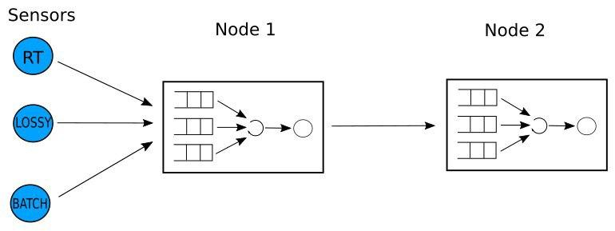

# Classes Queues

## Model
Here you can find the implementation of a simple network in which the nodes distinguish the jobs in classes:

Basically here we have:

- Three sensors, each of them produce a specific type of job (which are REAL_TIME, LOSSY, BATCH).

- Two nodes, which receive the jobs from the sensors, process them and send them to the next node.

Each node has three queues with a scheduler. The latter decide which job to process from the three queues. The policy followed by the scheduler is that REAL_TIME needs to be processed immediately if they are present. If not, it tries to schedule a LOSSY job which has a deadline. If the deadline is exceeded the scheduler drop the job. Finally if there aren't REAL_TIME or LOSSY jobs it schedules BATCH jobs.

## Implementation in RootSim
In order to simulate the network presented, we map each sensors and nodes to an LP. So in this case we have three LPs which represent the sensors and other two LPs which represent the nodes. Each LP containts some information on the simulation and the reference to the data used from the scheduler.

We divide the organization of the code in four main modules:

- Classes queues, this is the core of the simulation in which we use the rootsim's functions in order to administrate what each sensor and node need to do.

- Priority scheduler, here we manage the three queues of each LPs and we implement the policy of the model through a function which returns the next job to process.

- Topology (partop), in this module we implement all the utilities used to define the topology of the network. So potentially we can expand the topology presented in the previous network. Also there is a parser which take the data from the file topology.txt in order to initialize all the data structures to the topology written on it.

- Priority scheduler, here there is the implementation of a priority queue (in particular a heap) used by the scheduler.

### Events design in rootsim
We used four events in the rootsim environment in order to model what can happen and what every LP have to do during the simulation:

- INIT, here we simply initizialize every LP. We call the topolofy functions in order to get the organization of the network and the role of the actual LP (if NODE or SENSOR).

- GENERATE, this event is used only for the sensors. Indeed here we generate the jobs with some frequency (in this case we opt for a Poisson) and send them to the next node in the topology generating an ARRIVE event.

- ARRIVE, here the nodes get the new jobs and put them on the three queues data structure. Then it trigger a FINISH event if there is only one job to process which is the one just arrived.

- FINISH, this event basically represent the moment in which a node finish to process a job. Here the node send the job to the next node (if present) and schedule the next FINISH event if there are still job in the queues.

### Output
The simulation program sometimes prints on the shell some information on the simulation. In particular it report the number of jobs in the node, the arrival and processing rate, average responde time and the utilization factor.

## Setup
In order to run it, simply type:
> make
> ./queues --sequential --lp 5

